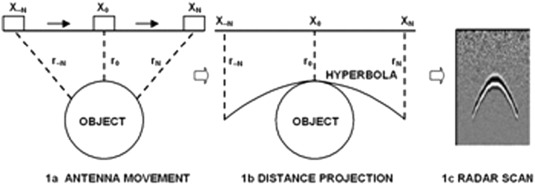
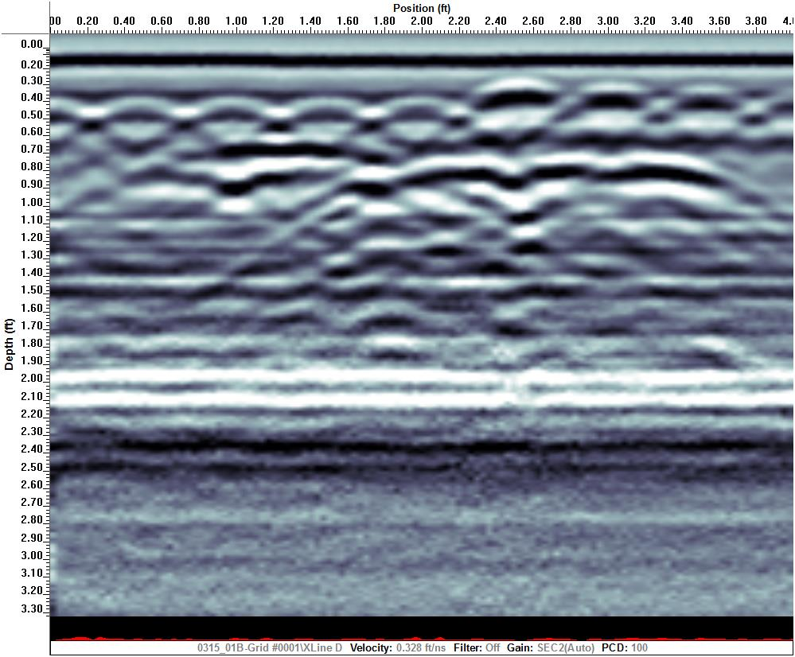

# gpr-data-classifier

Proof-of-concept side project for Sensors & Software Inc.

### Background Information ###
##### What is a hyperbola? #####
Hyperbolas are artefacts and evidences of disturbances in the soil, collected by ground penetrating radars. Below is a classic hyperbola:

And here are some not so obvious hyperbolas:

### Classifier implemented with MobileNet ###

Mobilenet was chosen for its potential for real-time detection of hyperbolas in ground penetrating data. To read more about the comparison process between the suitability of different pre-trained models, refer to the (WIP) [report](report/uw-wkrpt-se.pdf). 

